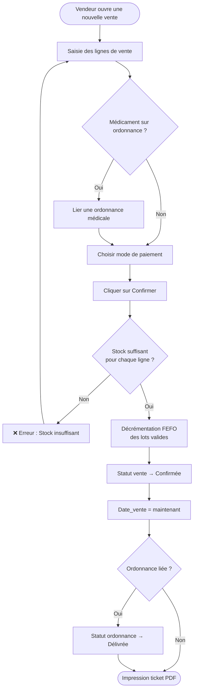
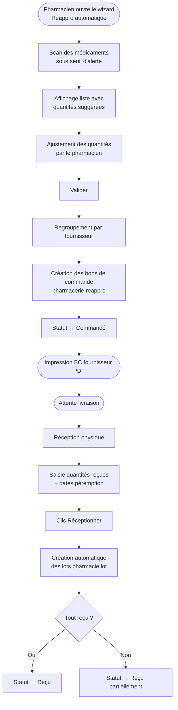
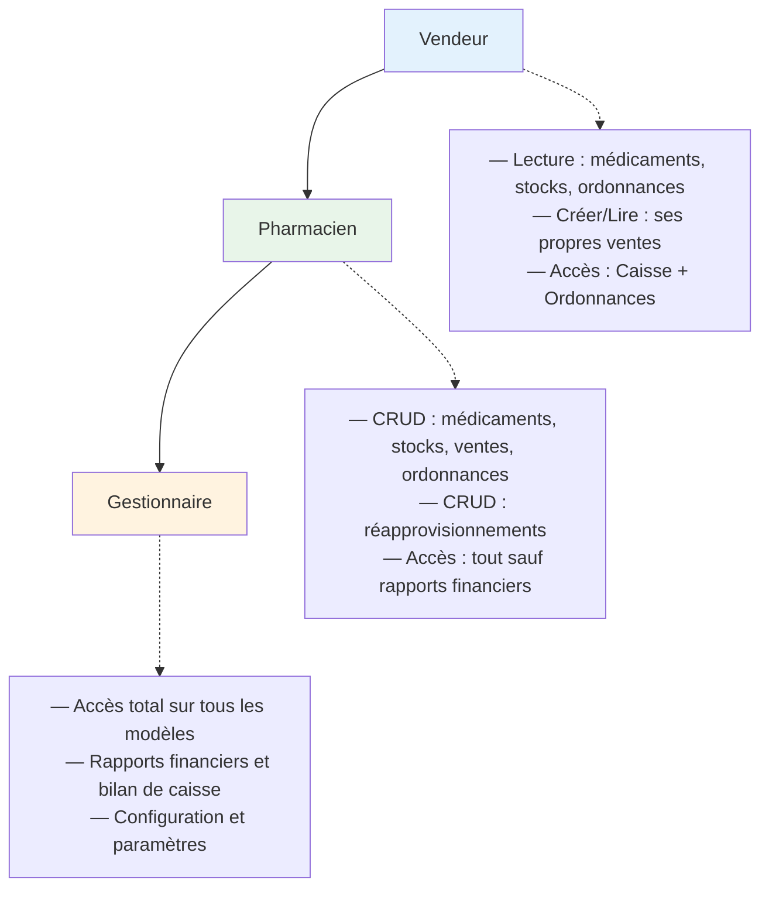

# Diagramme UML — Module `pharmacie_management`

## Diagramme de classes (Mermaid)

```mermaid
classDiagram
    direction LR

    class pharmacie_categorie {
        +Char name
        +Char code
        +Text description
        +Many2one parent_id
        +One2many child_ids
        +One2many medicament_ids
        +Integer medicament_count [computed]
    }

    class pharmacie_medicament {
        +Char reference [séquence]
        +Char nom_commercial
        +Char dci
        +Selection forme
        +Char dosage
        +Char conditionnement
        +Many2one categorie_id
        +Many2one fournisseur_id
        +Float prix_achat
        +Float prix_vente
        +Selection taux_tva
        +Float marge_pct [computed]
        +Boolean sur_ordonnance
        +Integer stock_actuel [computed]
        +Integer alerte_rupture
        +Selection statut_stock [computed]
        +Text notice
        +Binary photo
    }

    class pharmacie_lot {
        +Char numero_lot [séquence]
        +Many2one medicament_id
        +Date date_fabrication
        +Date date_peremption
        +Integer quantite_initiale
        +Integer quantite_restante
        +Float prix_achat_lot
        +Selection statut [computed]
        +Integer jours_avant_peremption [computed]
        +Many2one reappro_id
    }

    class pharmacie_vente {
        +Char reference [séquence]
        +Many2one client_id
        +Many2one vendeur_id
        +Many2one ordonnance_id
        +One2many ligne_ids
        +Float montant_ht [computed]
        +Float tva [computed]
        +Float montant_ttc [computed]
        +Selection statut
        +Selection mode_paiement
        +Datetime date_vente
        +Text note
        +action_confirmer()
        +action_annuler()
    }

    class pharmacie_vente_ligne {
        +Many2one vente_id
        +Many2one medicament_id
        +Many2one lot_id
        +Integer quantite
        +Float prix_unitaire
        +Float taux_tva [computed]
        +Float montant_ht [computed]
        +Float montant_tva [computed]
        +Float montant_ttc [computed]
    }

    class pharmacie_ordonnance {
        +Char reference [séquence]
        +Char patient_nom
        +Integer patient_age
        +Selection patient_genre
        +Char medecin_nom
        +Char structure_sante
        +Date date_prescription
        +Many2many medicament_ids
        +One2many posologie_ids
        +Selection statut
        +Many2one vente_id
        +Binary scan_ordonnance
    }

    class pharmacie_posologie {
        +Many2one ordonnance_id
        +Many2one medicament_id
        +Char posologie
        +Char duree
        +Integer quantite_prescrite
    }

    class pharmacie_reappro {
        +Char reference [séquence]
        +Many2one fournisseur_id
        +Date date_commande
        +Date date_livraison_prevue
        +One2many ligne_ids
        +Float montant_total [computed]
        +Selection statut
        +Text note_interne
        +action_envoyer_commande()
        +action_receptionner()
    }

    class pharmacie_reappro_ligne {
        +Many2one reappro_id
        +Many2one medicament_id
        +Integer quantite_commandee
        +Integer quantite_recue
        +Float prix_unitaire
        +Float montant_ligne [computed]
        +Date date_peremption_prevue
    }

    class res_partner {
        +Boolean is_fournisseur_pharma
        +Integer delai_livraison_moyen
        +Char numero_agrement
        +One2many reappro_ids
    }

    %% Relations
    pharmacie_categorie "1" --> "0..*" pharmacie_categorie : parent_id (auto-ref)
    pharmacie_categorie "1" --> "0..*" pharmacie_medicament : categorie_id

    pharmacie_medicament "1" --> "0..*" pharmacie_lot : medicament_id
    pharmacie_medicament "0..*" --> "1" res_partner : fournisseur_id

    pharmacie_lot "0..*" --> "1" pharmacie_reappro : reappro_id

    pharmacie_vente "1" --> "1..*" pharmacie_vente_ligne : ligne_ids
    pharmacie_vente "0..*" --> "0..1" pharmacie_ordonnance : ordonnance_id
    pharmacie_vente "0..*" --> "0..1" res_partner : client_id

    pharmacie_vente_ligne "0..*" --> "1" pharmacie_medicament : medicament_id
    pharmacie_vente_ligne "0..*" --> "0..1" pharmacie_lot : lot_id

    pharmacie_ordonnance "1" --> "0..*" pharmacie_posologie : posologie_ids
    pharmacie_ordonnance "0..*" --> "0..*" pharmacie_medicament : medicament_ids (M2M)

    pharmacie_reappro "1" --> "1..*" pharmacie_reappro_ligne : ligne_ids
    pharmacie_reappro "0..*" --> "1" res_partner : fournisseur_id

    pharmacie_reappro_ligne "0..*" --> "1" pharmacie_medicament : medicament_id

    pharmacie_posologie "0..*" --> "1" pharmacie_medicament : medicament_id
```

---

## Diagramme de flux — Processus de vente

---

## Diagramme de flux — Réapprovisionnement

---

## Schéma des groupes de sécurité

